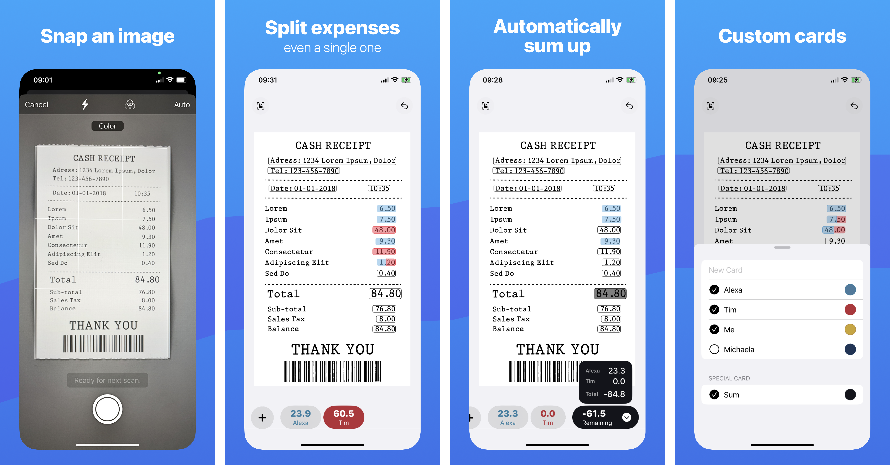

  

<h1 align="center"/>SplitBill</h1>

An iOS App to split transactions from an image

  

## SplitBill

SplitBill is an iOS App to sum up transactions from an image and split them between people, categories, or anything else that makes sense to you.

It is available on the App Store for free: [Download](https://apps.apple.com/de/app/splitbill-split-from-image/id6444704240?l=en-GB).
